<!-- Dynamic Animated Banner -->
<p align="center">
  
</p>

<!-- Typing SVG Subtitle -->
<p align="center">
  
</p>

<!-- Visitor Counter & Badges -->
<p align="center">
  
  
</p>

<p align="center">
  <a href="https://www.linkedin.com/in/muhammad-hanzala-47439328a/">
    
  </a>
  <a href="mailto:hani75384@gmail.com">
    
  </a>
  <a href="https://www.fiverr.com/sellers/mr0_0hani/">
    
  </a>
  <a href="https://www.upwork.com/freelancers/~01dcd0859017452a7e">
    
  </a>
</p>

---

## 🌌 ABOUT THE ARCHITECT

> **"Where robust logic meets high-end aesthetics."**

I am a **Computer Science Undergraduate (6th Semester)** at the **Institute of Space Technology (IST), Islamabad**, specializing in **Native Android Development (Java / MVVM)**, **Human-Computer Interaction (HCI)**, and **Creative Visual Design**. 

As a **Self-Employed Freelancer**, I turn complex software architectures into intuitive user experiences and automate workflows to supercharge efficiency.

* 🎓 **Academic Base:** IST, Islamabad — Focus on Advanced Android, DBMS, and HCI.
* 🤖 **Automation Mindset:** Leveraging Python and n8n to automate the mundane.
* 🎨 **Creative Dimension:** Custom UI/UX, Blender 3D modeling, and high-fidelity video production.

---

## 🏆 GITHUB TROPHIES

<p align="center">
  
</p>

---

## 🛠️ THE COGNITIVE ARSENAL

### 💻 **Development & Languages**
```yaml
Languages:  [ Java, Python, C++, SQL, JavaScript, TypeScript, C#, PHP ]
Mobile:     [ Android SDK, XML Layouts, Room DB, Retrofit, Firebase Suite ]
Design:     [ MVVM Architecture, Clean Architecture, OOP, HCI Principles ]
```
<p align="left">
  
  
  
  
  
</p>

### 🎨 **Creative Suite & Automation**
```yaml
Creative:   [ Adobe Photoshop, After Effects, Premiere Pro, Blender, Figma ]
Automation: [ n8n Automation, Python Web Scrapers, Cron Jobs ]
Web Stack:  [ HTML5, CSS3, MERN Stack (Learning) ]
```
<p align="left">
  
  
  
  
  
</p>

---

## ⚡ FEATURED MISSIONS (PROJECTS)

<details open>
<summary><b>📱 MOBILE MISSIONS</b></summary>
<br>

### 🟢 **Smart Campus Navigation & Safety Assistant**
> A dual-platform system for indoor/outdoor navigation and student safety.
* **Tech:** Java, Android SDK, XML, Firebase Realtime DB, Google Maps API, Leaflet.js.
* **Core:** Features interactive map routing, offline navigation fallbacks, and a one-tap SOS emergency alert system.

### 🟢 **Smart Study Companion**
> A high-productivity student hub featuring task scheduling and offline database synchronization.
* **Tech:** Java, XML, MVVM, Room Database, SQLite.
* **Core:** Implements local caching, background sync, and MVVM architecture for reactive UI updates.

</details>

<details>
<summary><b>🤖 AI & SaaS PROJECTS</b></summary>
<br>

### 🔵 **Vision Forge AI PRO**
> An advanced image-generation and manipulation workspace utilizing state-of-the-art generative AI APIs.
* **Tech:** TypeScript, React, Node.js, Express, TailwindCSS.
* **Core:** Real-time asset pipeline, secure API proxying, and responsive, fluid workspace UI.

### 🔵 **Cheesy Burger SaaS Voice Agent**
> A SaaS platform implementing high-fidelity conversational voice agents.
* **Tech:** PHP, Python, WebSockets, OpenAI TTS/STT APIs.
* **Core:** Ultra-low latency voice feedback loops, user subscription plans, and conversation analytics dashboard.

</details>

<details>
<summary><b>🏢 SYSTEM ARCHITECTURES</b></summary>
<br>

### 🟣 **University Library Management System**
> Desktop management system automating cataloging, book circulation, and transaction tracking.
* **Tech:** C#, .NET, Microsoft SQL Server, Entity Framework.
* **Core:** Features role-based access control, automatic fine computation, and rich analytical reports.

### 🟣 **Digital Health Portal**
> A user-centered patient monitoring dashboard designed with advanced accessibility standards.
* **Tech:** Figma, UI/UX Prototyping, Usability Testing.
* **Core:** Features high-contrast modes, scalable layouts, and responsive health telemetry visualizations.

</details>

---

## 📊 ANALYTICS CORE

<div align="center">
  
  
</div>

<br>

<p align="center">
  
</p>

---

## 📡 ESTABLISH CONNECTION

<p align="center">
  <a href="https://www.linkedin.com/in/muhammad-hanzala-47439328a/">
    
  </a>
  <a href="mailto:hani75384@gmail.com">
    
  </a>
  <a href="https://www.fiverr.com/sellers/mr0_0hani/">
    
  </a>
  <a href="https://www.upwork.com/freelancers/~01dcd0859017452a7e">
    
  </a>
</p>

---

<p align="center">
  
</p>
<p align="center" style="font-family: 'Share Tech Mono', monospace; color: #00E5FF;">
  // TERMINAL SESSION CLOSED. GODSPEED, DEVELOPER.
</p>
